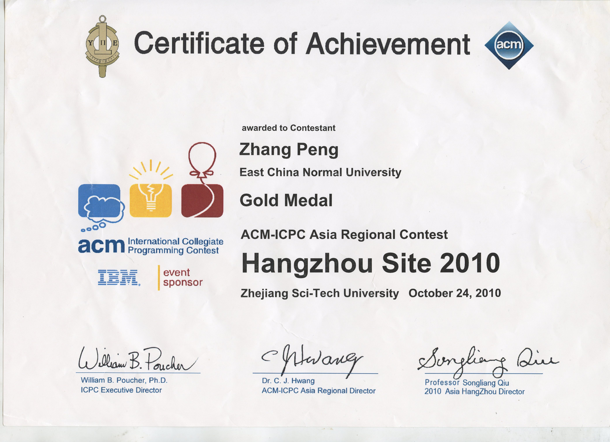

I studied Software Engineering at East China Normal University from 2006 to 2010. During that time, I competed in the 
[International Collegiate Programming Contest (ICPC)](https://icpc.global/) and won a Gold Medal with two great teammates. 
We finished 10th and didn't make the World Final. Back then, I didn't know that ICPC problems would later become popular in software engineering interviews. 
I don't think Engineer A is better than Engineer B just because A is better at solving ICPC problems. However, solving ICPC problems shows that an engineer 
can code and talk about algorithms and data structures. So, in my opinion, using ICPC problems in interviews is like 
using credit scores for loan applications; you don't compare individuals, but rather groups.

In this repository, I store my solutions to Leetcode problems as I practice them occasionally.

To the memorable summer training camp of 2010! 

