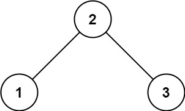

https://leetcode.com/problems/validate-binary-search-tree/description/

Given the root of a binary tree, determine if it is a valid binary search tree (BST).

A valid BST is defined as follows:
1. The left subtree of a node contains only nodes with keys less than the node's key.
1. The right subtree of a node contains only nodes with keys greater than the node's key.
1. Both the left and right subtrees must also be binary search trees.


### Example 1:

```text
Input: root = [2,1,3]
Output: true
```

### Example 2:

```text
Input: root = [5,1,4,null,null,3,6]
Output: false
Explanation: The root node's value is 5 but its right child's value is 4.
```

## Constraints:

1. The number of nodes in the tree is in the range `[1, 10^4]`.
1. `-2^31 <= Node.val <= 2^31 - 1`
